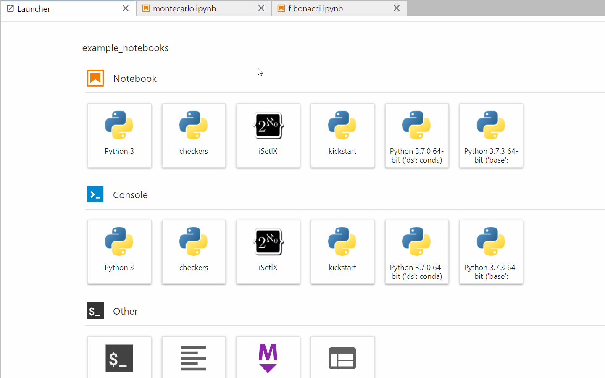
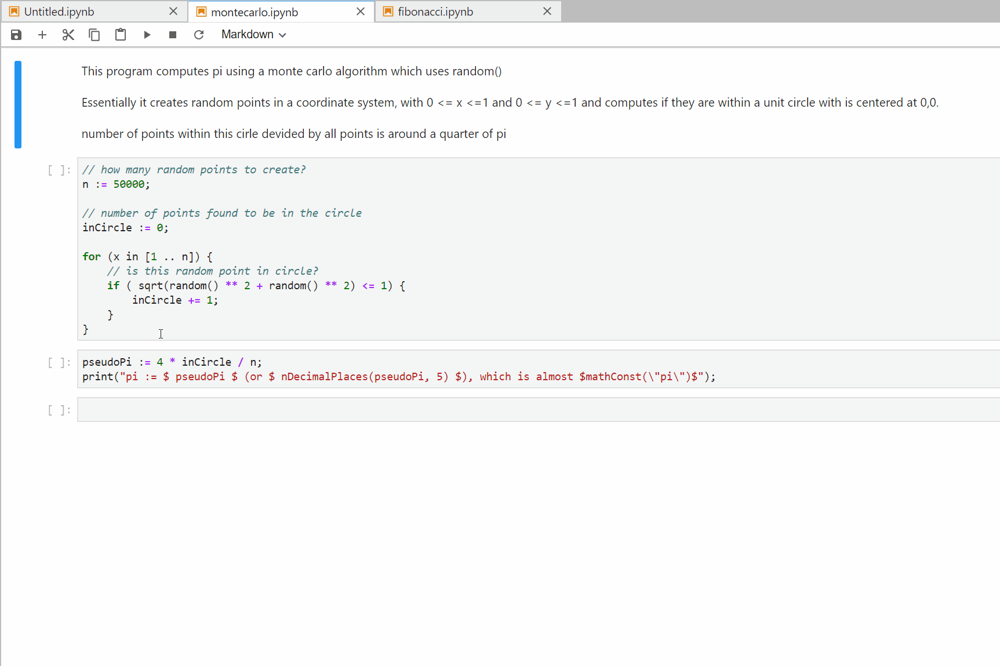

iSetlX
======

> Do you think God stays in heaven because he, too, lives in fear of what he's created here on earth?

The goal of this project is to provide support for [SetlX](https://randoom.org/Software/SetlX/) in Jupyter Notebooks.
The kernel is implemented as a Python wrapper that forwards input and output between an interactive SetlX subprocess and active notebooks.
Please refer to the official documentation for possible alternative implementations: https://jupyter-client.readthedocs.io/en/latest/kernels.html

Setup
-----
```
$ pip install isetlx
$ python -m isetlx.install
```

Demo
----



### Known Issues
- calling print("=>"); delays all following cell output by 1 execution
- kernel checks for new output in 0.2s intervals, which might cause a delay in forwarding
- syntax highlighting based on Java

#### Special Thanks
[Paul Kupper](https://github.com/pkupper) for suggesting the use of byte streams

